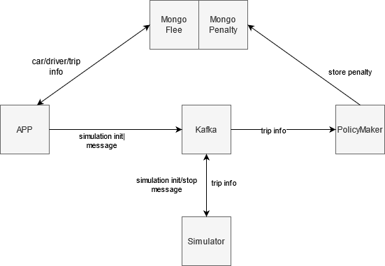

# Fleet Management System

## Description
### Scenario
The current flee management system is based on the following scenario.
There is a company that have a number of drivers (employees) and owes a number of cars.
A user (could be an admin or an employee) can register new drivers or new cars to the system using an API.
A driver is assigned to a car in order to execute a predetermined trip which the starting and the ending point are already known. During the trip, the car produces several metrics (speed, position) which are evaluated against specific rules. In particular, if the speed of the car exceeds certain limits the driver is penalized.

## High Level Architecture
The system consists of 5 components:
1. App (Microservice A)
2. Simulator (Microservice B)
3. PolicyMaker (Microservice C)
4. MongoDB
5. Kafka

The App essentially is used to control the system. Through the App, the user can add, retrieve, update or delete a driver or car. Also, from there a trip can be initialized. A trip is initialized by providing a driver's id, a car's, longitude and latitude of the starting point and longitude and latitude of the finishing point. All the above information is saved permanently in MongoDB. Then someone can start a simulation. For the simulation to start, a message is transmitted to a Kafka topic. The simulator that listens to this topic receives the message and runs the simulation. While the simulation runs, messages which include information for the trip are transmitted to a Kafka topic. This information is consumed by the PolicyMaker(microservice C) which stores it in MongoDB. The PolicyMaker evaluates if the speed of the car exceeds certain limits and if so calculates a penalty and assigns it to the driver. Lastly, it exposes an endpoint that returns the driver's id along with their penalty. 




## Architectural Components 
### 1. App

#### Core Technologies Used
* flast_restful
* pydantic
* confluent_kafka
* pymongo


The App follows the hexagonal architecture. 
In the file *views.py* there are exposed four APIs;
1. CarAPI
- Performs CRUD operations for Cars.
2. DriverAPI
- Performs CRUD operations for Drivers.
3. TripAPI
- Performs CRUD operations for Trips.
4. TripsStatusAPI
- Receives a GET request with the id of the trip that needs to be simulated.
- Produces a message to Kafka to start the simulation.

For every API call that is received a new instance of the DB is initialized. This way the application can scale better than having just one DB instance passing it around the different APIs.
To build the application, flask blueprints have been used. Blueprints facilitate the readability, scalability and maintainability of the application especially when the application becomes very large.
To pass different arguments with the API calls I used reqparse. To make the code cleaner, Parser is a different file to my design that uses different initializers depending on the use case. Thus, there are three different parsers (car_parser, driver_parser, trip_parser), each for every API.

In folder services, it is written all the logic of the app. There are three services files (car_services.py, driver_services.py and trip_service.py) one for each instance.

In folder models, there are all the models of the system (car, driver, trip). To build the model, I used *pydantic* which helps in mapping JSON with classes and facilitates the easy and fast transformation of an object to dictionary (even with nested objects). For cars and drivers, there is also an Enum class that indicates if the driver or the car is available to be assigned for a trip.

Lastly, there is a Kafka producer which sends the message for the simulation to start.

### 2 Simulator
#### Core Technologies Used
* pandas
* pydantic
* confluent-kafka


The simmulator utilizes a kafka consumer which receives a json file with the following structure:
```json
{
    "trip_id": "bbd0e608d3b0488098cce7700e415c69", 
    "driver_id": "1f889d4a22cf4ef182803d1d5104d776", 
    "car_id": "4c34375aac3b4601a22dbc4e269d71e7", 
    "start_lon": -73.9790267944336, 
    "start_lat": 40.7639389038086, 
    "finish_lon": -74.0053329467773, 
    "finish_lat": 40.7100868225098
}
```

The simulator uses the models Car, Coordinates and Root to simulate a car that follows the spcific root. The car consists of a driver id, car id, trip id, speed and position.

The simulator follows the step below:
1. Creates a starting point with starting longitude and latitude
2. Creates a finishing point with finishing longitude and latitude
3. Using the start point and the finishing point creates a root
4. The simulator takes as input the car, the root and the intervals that will send the heartbeats
5. A random duration for the trip is calculated
6. Number of heartbeats is calculated by dividing the duration by the intervals
7. We calculate how much the latitude and longitude of the car should be increased every interval in order for the trip to finish after the specified duration
8. In every interval a random value is added to the speed of the car. The speed cannot be less than 0
9. In every interval the coordinations are increased by the value that is calculated at the previous steps.
10. In every interval a JSON with the following structure is sent to a Kafka topic. 

```json
{
    "car_id": "4c34375aac3b4601a22dbc4e269d71e7", 
    "driver_id": "1f889d4a22cf4ef182803d1d5104d776", 
    "trip_id": "bbd0e608d3b0488098cce7700e415c69", 
    "speed": 17.10000000000001, 
    "position": {
        "lon": -74.00533294677678, 
        "lat": 40.71008682250977
        }
    }
```


### 3 PolicyMaker
#### Core Technologies Used
* flast_restful
* pydantic
* confluent_kafka
* pymongo

PolicyMaker runs a flask API to expose the penalty of the drivers and a Kafka consumer to consume message from the simulator. Due to the fact that they cannot run using the same thread, the main thread is assigned to flask and a secondary thread is assigned to the consumer.
When the consumer receives a message 3 services are utilized. The first one adds the new heartbeat in the MongoDB in the collection *trips*. **Note the DB of the microservice A and the microservice B are two different dbs**.
The second service adds a driver in the DB in the collection *drivers*, initializes their score to 0 and assigns them the trip.
Lastly, the last service calculates the penalty and updates the appropriate field in the DB.

### 4 MongoDB
Using the microservice of MongoDB I created two databases; *flee*, which is used by microserviceA, and *penalty* which is used by microservice C. Database *flee* is used to store cars, drivers and trips. Database *penalty* has two collections; *drivers* and *trips*. In collection *drivers*, it is stored for each driver, their driver_id, penalty, and the ids of their trips. In collection *trips*, for every trip it stored, trip id, driver id, car id as well as all the heartbeats that have been sent for this trip. Heartbeat includes the speed and position of the simulated car.

## How to run it

1. To run mongodb, kafka and zookeeper go to the directory *root* and run:
```
docker-compose up -d
```
2. To run microservice A, open a terminal, go in the directory *microserviceA* and run:
```
python3 main.py
```
3. To run microservice B, open a new terminal, go in the directory *microserviceB* and run:
```
python3 main.py
```
4. To run microservice C, open  new terminal, go in the directory *microserviceC* and run:
```
python3 main.py
```
5. Add a car by sending a post request to the following url
```
http://0.0.0.0:8000/api/cars
```
passing the following json
```json
{
	"brand":"opel",
	"model":"astra",
	"license_plate":"AZH8750"
}
```
6. Add a driver by sending a post request to the following url
```
http://0.0.0.0:8000/api/drivers
```
passing the following json
```json
{
	"first_name":"kostas",
	"last_name":"karagkounis",
	"license_number":"adsffg"
}
```
7. Initialize a trip by sending a post request to the following url
```
http://0.0.0.0:8000/api/trips
```
passing the following json **(driver_id and car_id should be replaced with the ones produced in the earlier step)**
```json
{
	"driver_id":"",
	"car_id":"",
	"start_lon":-73.9790267944336,
	"start_lat":40.7639389038086,
	"finish_lon":-74.0053329467773,
	"finish_lat":40.7100868225098
}
```
8. Start simulation by sending the following get request **(<trip_id></trip_id> should be replaced by the trip_ide produced in the previous step)**
```
http://0.0.0.0:8000/api/tripstatus/<trip_id>
```

1. To get the penalty of the user send the following get request **(<driver_id> should be replaced by the trip_ide produced in the previous step)**
```
http://0.0.0.0:8001/api/driverpenalty/<driver_id>
```

## Issues, Technical Dept and Future Improvements
1. Although I created the docker images and containers for the services I developed, I couldn't connect them to Kafka. Building and running them with docker-compose they run in the same network. So, I would expect that by specifying the DNS of Kafka to the producers and consumers of my microservices, it would work normally but unfortunately, I had an error. Due to limited time, I couldn't find the error.
2. Some of the variables in the code like IP addresses, topics etc, may be hardcoded. However, in normal situations are defined as environmental variables.
3. Error handling is missing due to limited time. It can be done using try and except statements and custom exceptions.
4. **NOTE**: I am sending .env only for reasons of convenience. In a production environment, we don't send .env.
5. API at microserviceC returns only the driver_id and the penalty. However, we could return more info that is already stored in the DB such as all the trips that the driver did or all the heartbeats for some trip.


